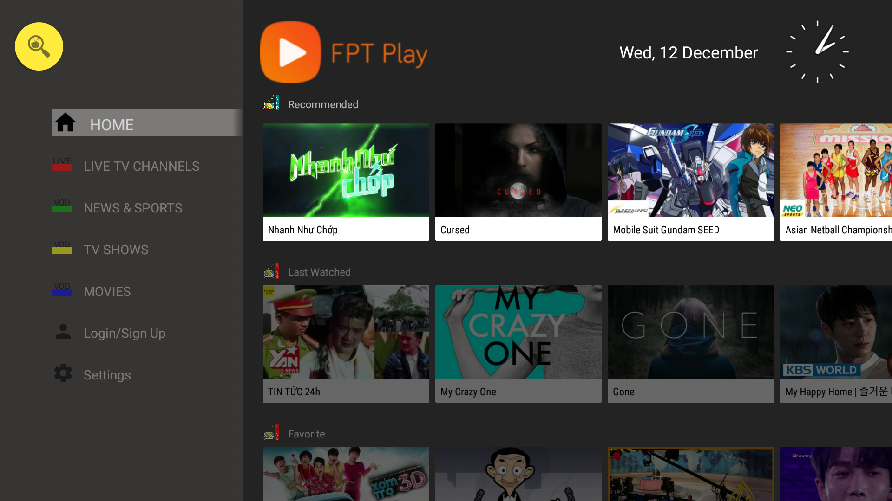
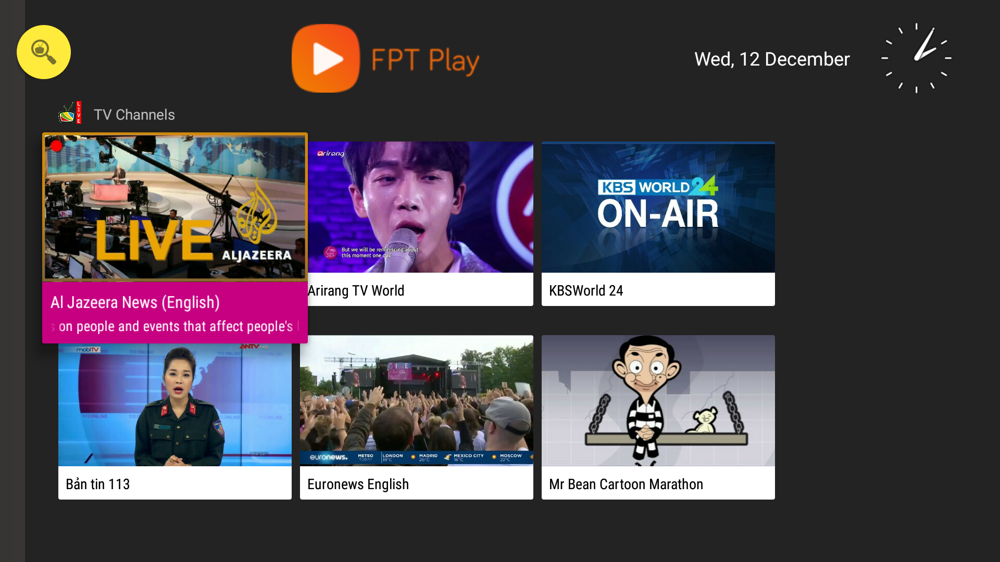
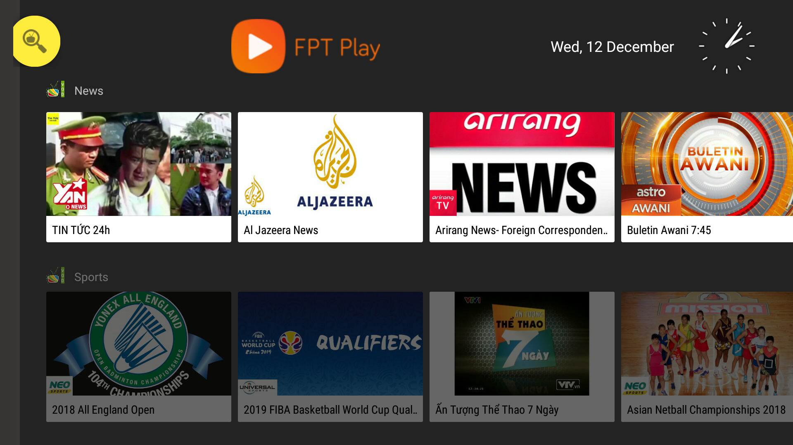
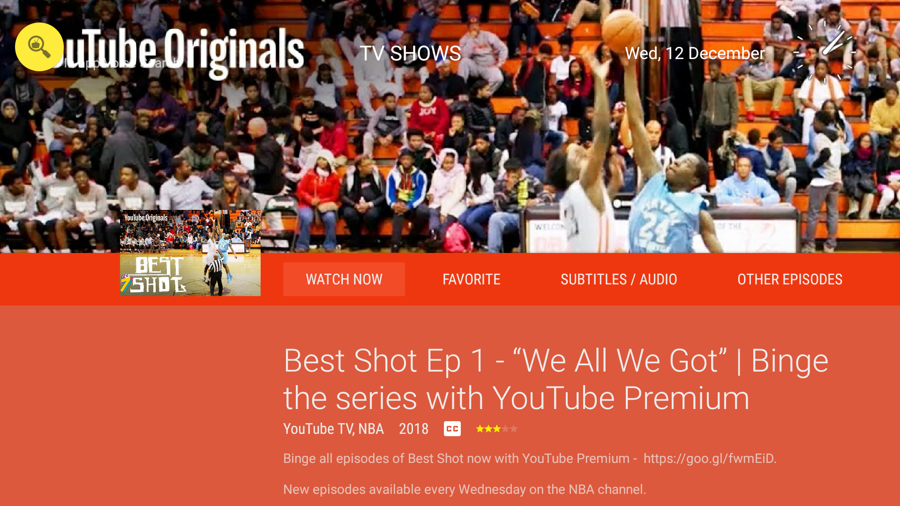
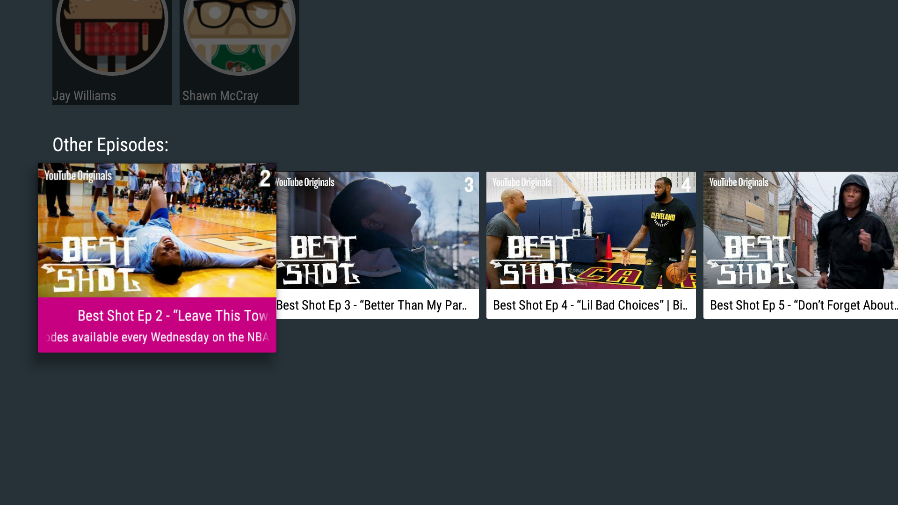
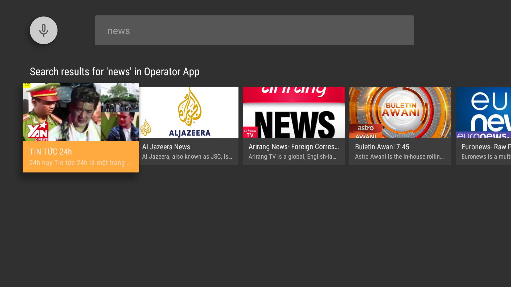

# Operator App Prototype using Leanback Support Library Showcase App for Android TV
Operator App prototype to portrays what an Operator App can deliver using YouTube videos as our content.

## Features supported
- Live Videos & Videos on Demand (VODs).
- Live Videos are demostrated like they're live TV channels. [Can use CH+/CH- buttons to change channels]
- VODs are demostrated as several categories; News & Sports, TV Shows, & Movies
- Red/Green/Blue/Yellow buttons are used as shortcut keys to each category respectively.
- Voice search can be used inside & outside the app.
- Can play/pause/rewind/fast forward/skip next/skip previous using their respective button on remote control.

## Screenshots

Need more information about using Leanback Support Library? Check the [official docs][getting-started].

## Support

If you need additional help regarding using Leanback Support Library, these community might be able to help.

- Android TV Google+ Community: [https://g.co/androidtvdev](https://g.co/androidtvdev)
- Stack Overflow: http://stackoverflow.com/questions/tagged/android-tv

## License

Licensed under the Apache 2.0 license. See the [LICENSE file][license] for details.

[store-apps]: https://play.google.com/store/apps/collection/promotion_3000e26_androidtv_apps_all
[studio]: https://developer.android.com/tools/studio/index.html
[getting-started]: https://developer.android.com/training/tv/start/start.html
[bugs]: https://github.com/googlesamples/androidtv-Leanback/issues/new
[contributing]: CONTRIBUTING.md
[license]: LICENSE
